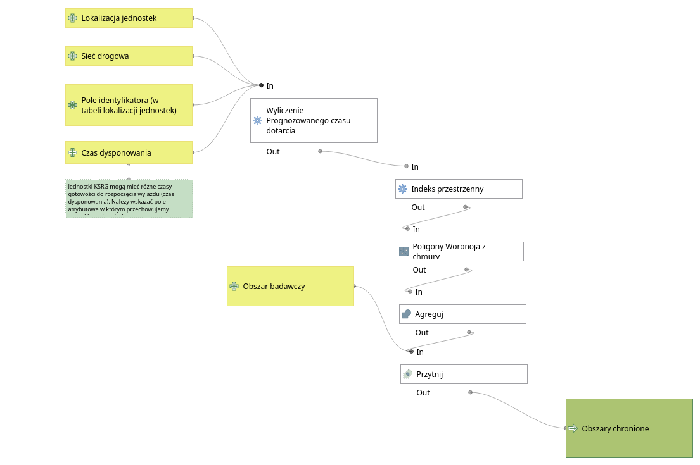

# Czas dojazdu
Izochrona, czas dojazdu i obszar chroniony w QGIS - modele i skrypty

## Wymagania

* QGIS 3.4 LTR
* wtyczka QNEAT3, wraz z bibliotekami matplotlib, numpy (python3)

## Źródła danych
* dane wektorowe o sieci drogowej
* dane wektorowe o lokalizacji jednostek
* dane wektorowe granic administracyjnych (opcjonalnie)
* dane wektorowe obwodów spisowych (opcjonalnie)

## Przygotowanie danych

W repozytorium znajdują się modele QGIS 3 przygotowujące pliki dostarczane przez Geofabrik.de lub z danych BDOT10k. Należy wywołać model, wskazując oryginalną warstwę danych, a następnie wynikową warstwę danych zapisać na dysk.

Zasada działania preprocessingu opisana jest przez następujący graf:

Dodatkowo przygotowane zostały wersje tego modelu i algorytmu dla różnych parametrów prędkościowych, zależnie od przyjętej metodyki.

## Obszar chroniony

Zasada działania modelu opisana na grafie:

Model wymaga podania warstwy sieciowej w CRS kartezjańskim (np. PL-1992 EPSG:2180), warstwy punktowej z lokalizacją jednostek, warstwy poligonowej ograniczającej obszar analizy (np. obszar administracyjny KP PSP), nazwy pola w którym przechowywany jest identyfikator punktu startowego (np. nazwa jednostki), nazwy pola w którym przechowywana jest informacja o przewidywanym czasie dysponowania (przyjmowany na podstawie metodyki, lub średnich czasów wyjazdu jednostki w SWD-ST).  

## Procent populacji, procent powierzchni

Zasada działania modelu opisana na grafie:

Model do poprawnego działania wymaga warstwy wektorowej obwodów spisowych lub siatki kilometrowej (PD_BREC, PD_GRID).
